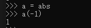

* content
{:toc}


主要参考廖雪峰老师网站，过一遍py

## 一、Py基础

py输出不换行   print(key, end=" ") end表示字符间的字符

### 各个内置函数

#### 1.input函数得到的是str ，需要用int()函数进行转换

```
age = int(input('birth:'))
```

#### 2.`range()`函数

可以生成一个整数序列，再通过`list()`函数可以转换为list。比如`range(5)`生成的序列是从0开始小于5的整数

```
>>> list(range(5))
[0, 1, 2, 3, 4]
```

3.


### 1.用`r''`表示`''`内部的字符串默认不转义

```python
>>> print('\\\t\\')
\       \
>>> print(r'\\\t\\')
\\\t\\
```


### 2、在计算机内存中，统一使用Unicode编码，当需要保存到硬盘或者需要传输的时候，就转换为UTF-8编码。


对于单个字符的编码，Python提供了`ord()`函数获取字符的整数表示，`chr()`函数把编码转换为对应的字符：

### 3、列表和元组

**列表**：list。list是一种有序的集合，可以随时添加和删除其中的元素。

```
classmates = ['Michael', 'Bob', 'Tracy']
```

用`-1`做索引，直接获取最后一个元素  a[0]

```
append 追加到末尾，
insert 到指定位置 S.insert(1, 'b') ，
要删除list末尾的元素，用pop()方法：
要删除指定位置的元素，用pop(i)方法，其中i是索引位置：
要把某个元素替换成别的元素，可以直接赋值给对应的索引位置： S[1] = 
sort() 进行排序改变
reverse()函数进行倒向打印
len()确定长度
```

**元组**：tuple ，tuple一旦初始化就不能修改,因为tuple不可变，所以代码更安全。

```
classmates = ('Michael', 'Bob', 'Tracy')
```

注意：只有1个元素的tuple定义时必须加一个逗号`,`，来消除歧义

```
比如：t = (1)  由于可能歧义表示为数字里的小括号
所以 要想表示元组，必须为 t = (1,)
```

uple所谓的“不变”是说，tuple的每个元素，指向永远不变。即引用对象不变。

但是若引用的为列表，列表中的数据可以改变。

### 4、if else elif

```
if con : 记得打冒号
elif是else if的缩写
```

### 5、for & while

`for x in ...`循环就是把每个元素代入变量`x`，然后执行缩进块的语句。

`while n > 0:`

break & continue 用法一样

### 6、字典 dict & set

#### 1、dict 

在其他语言中也称为map，用键-值（key-value）存储，具有极快的查找速度。

```
>>> d = {'Michael': 95, 'Bob': 75, 'Tracy': 85}
>>> d['Michael']
95

```

把数据放入dict的方法，除了初始化时指定外，还可以通过key放入：

```
>>> d['Adam'] = 67
```

避免key不存在的错误，有两种办法，一是通过`in`判断key是否存在

```
>>> 'Thomas' in d
False
```

通过dict提供的`get()`方法，如果key不存在，可以返回`None`

```
>>> print(d.get('sa')) 
None
```

要删除一个key，用`pop(key)`方法，对应的value也会从dict中删除：

```
>>> d.pop('Bob')
```

#### 2、set

set和dict类似，也是一组key的集合，但不存储value。即类似HashMap和HashSet

通过`add(key)`方法可以添加元素到set中，通过`remove(key)`方法可以删除元素

set可以看成数学意义上的无序和无重复元素的集合，因此，两个set可以做数学意义上的交集、并集等操作：

```
>>> s1 = set([1, 2, 3])
>>> s2 = set([2, 3, 4])
>>> s1 & s2
{2, 3}
>>> s1 | s2
{1, 2, 3, 4}
```


### 7、函数

1.函数名其实就是指向一个函数对象的引用，完全可以把函数名赋给一个变量，相当于给这个函数起了一个“别名”：



2.空函数

如果想定义一个什么事也不做的空函数，可以用`pass`语句：

```
def nop():
    pass
```

`pass`语句什么都不做，那有什么用？实际上`pass`可以用来作为占位符，比如现在还没想好怎么写函数的代码，就可以先放一个`pass`，让代码能运行起来。

**`pass`还可以用在其他语句里**，比如：

```
if age >= 18:
    pass
```

缺少了`pass`，代码运行就会有语法错误。


3.多参数返回

```
import math

def move(x, y, step, angle=0):
    nx = x + step * math.cos(angle)
    ny = y - step * math.sin(angle)
    return nx, ny

r = move(100, 100, 60, math.pi / 6)
print(r)
```

> 输出结果：(151.96152422706632, 70.0)

即输出为元组！


4.函数的参数

这个时候，默认参数就排上用场了。由于我们经常计算x2，所以，完全可以把第二个参数n的默认值设定为2：

```
def power(x, n=2):
```

当我们调用`power(5)`时，相当于调用`power(5, 2)`

一是必选参数在前，默认参数在后，否则Python的解释器会报错。很容易理解，否则就不知道填入的参数是哪一个


#### 1.一个注意点：

先定义一个函数，传入一个list，添加一个`END`再返回：

```
def add_end(L=[]):
    L.append('END')
    return L
```

当你正常调用时，结果似乎不错：

```
>>> add_end([1, 2, 3])
[1, 2, 3, 'END']
>>> add_end(['x', 'y', 'z'])
['x', 'y', 'z', 'END']
```

当你使用默认参数调用时，一开始结果也是对的：

```
>>> add_end()
['END']
```

但是，再次调用`add_end()`时，结果就不对了：

```
>>> add_end()
['END', 'END']
>>> add_end()
['END', 'END', 'END']
```

很多初学者很疑惑，默认参数是`[]`，但是函数似乎每次都“记住了”上次添加了`'END'`后的list。

原因解释如下：

Python函数在定义的时候，默认参数`L`的值就被计算出来了，即`[]`，因为默认参数`L`也是一个变量，它指向对象`[]`，每次调用该函数，如果改变了`L`的内容，则下次调用时，默认参数的内容就变了，不再是函数定义时的`[]`了。

 **----------------定义默认参数要牢记一点：默认参数必须指向不变对象！----------------**

要修改上面的例子，我们可以用`None`这个不变对象来实现：

```
def add_end(L=None):
    if L is None:
        L = []
    L.append('END')
    return L
```


#### 2.定义可变参数 * & 关键字参数 **

```
def calc(*numbers):
    sum = 0
    for n in numbers:
        sum = sum + n * n
    return sum
```

定义可变参数和定义一个list或tuple参数相比，仅仅在参数前面加了一个`*`号。在函数内部，参数`numbers`接收到的是一个tuple，因此，函数代码完全不变。但是，调用该函数时，可以传入任意个参数，包括0个参数：

可变参数类似指针，输入参数时也是指针形式

```
>>> calc(1, 2)
5
>>> calc()
0
```

对于list 或者 tuple

```
>>> nums = [1, 2, 3]
>>> calc(*nums)
14
```

**可变参数允许你传入0个或任意个参数，这些可变参数在函数调用时自动组装为一个tuple。**

**而关键字参数允许你传入0个或任意个含参数名的参数，这些关键字参数在函数内部自动组装为一个dict。**

```
def a(x, y):
    print(x + y)

a(x='sa',y='cc')
a(y='sa',x='cc')

输出：
sacc
ccsa
```

因此关键字参数的传递必须是 a=b 的格式,  也可以先组装出一个dict，然后，把该dict转换为关键字参数传进去：

```
def person(name, age, **kw):
    print('name:', name, 'age:', age, 'other:', kw)
    
>>> extra = {'city': 'Beijing', 'job': 'Engineer'}
>>> person('Jack', 24, **extra)
name: Jack age: 24 other: {'city': 'Beijing', 'job': 'Engineer'}
```

#### 3.使用任意数量的关键字实参

形参**user_info中的两个星号让Python创建一个名为user_info的空字典，并将收到的所有名称—值对都封装到这个字典中。在这个函数中，可以像访问其他字典那样访问user_info中的名称—值对。

```
def build_pro(first, last, **user_info):
    profile = {}
    profile['first'] = first
    profile['last'] = last
    for key, value in user_info.items():
        profile[key] = value
    
    return profile

user_profile = build_pro('albert', 'einstein',
                             location='princeton',
                             field='physics')
print(user_profile)

输出：
{'first': 'albert', 'last': 'einstein', 'location': 'princeton', 'field': 'physics'}
```


### 8、高级特性

#### 1.切片

L可为元组 、列表、字符串

`L[0:3]`表示，从索引`0`开始取，直到索引`3`为止，但不包括索引`3`。即索引`0`，`1`，`2`，正好是3个元素。`L[0:3] == L[:3]` 表示取到前三个

前10个数，每两个取一个：

```
>>> L[:10:2]
[0, 2, 4, 6, 8]
>>> 'ABCDEFG'[::2]
'ACEG
```

类似的，既然Python支持`L[-1]`取倒数第一个元素，那么它同样支持**倒数切片**，试试：

```
>>> 'abcdefg'[-1:]
'g'
>>> 'abcdefg'[-5:] 
'cdefg'
>>> 'asdfghjkl'[:-1] 
'asdfghjk'
```

记住倒数第一个元素的索引是`-1`。

#### 2.迭代

```
>>> d = {'a': 1, 'b': 2, 'c': 3}
>>> for key in d:
...     print(key)
...
a
c
b
```

因为dict的存储不是按照list的方式顺序排列，所以，迭代出的结果顺序很可能不一样。

默认情况下，dict迭代的是key。如果要迭代value，可以用`for value in d.values()`，如果要同时迭代key和value，可以用`for k, v in d.items()`。

所以，当我们使用`for`循环时，只要作用于一个可迭代对象，`for`循环就可以正常运行，而我们不太关心该对象究竟是list还是其他数据类型。

那么，如何判断一个对象是可迭代对象呢？方法是通过collections模块的Iterable类型判断：

```
>>> from collections import Iterable
>>> isinstance('abc', Iterable) # str是否可迭代
True
>>> isinstance([1,2,3], Iterable) # list是否可迭代
True
>>> isinstance(123, Iterable) # 整数是否可迭代
False
```

如果要对list实现类似**Java那样的下标循环怎么办**？Python内置的`enumerate`函数可以把一个list变成索引-元素对，这样就可以在`for`循环中同时迭代索引和元素本身：

```
>>> for i, value in enumerate(['A', 'B', 'C']):
...     print(i, value)
...
0 A
1 B
2 C
```


#### 3.列表生成器

写列表生成式时，把要生成的元素`x * x`放到前面，后面跟`for`循环，就可以把list创建出来，十分有用，多写几次，很快就可以熟悉这种语法。

for循环后面还可以加上if判断，这样我们就可以筛选出仅偶数的平方：

```
>>> [x * x for x in range(1, 11) if x % 2 == 0]
[4, 16, 36, 64, 100]
```

还可以使用两层循环，可以生成全排列：

```
>>> [m + n for m in 'ABC' for n in 'XYZ']
['AX', 'AY', 'AZ', 'BX', 'BY', 'BZ', 'CX', 'CY', 'CZ']
```

#### 4、生成器

如果列表元素可以按照某种算法推算出来，那我们是否可以在循环的过程中不断推算出后续的元素呢？这样就不必创建完整的list，从而节省大量的空间。在Python中，这种一边循环一边计算的机制，称为生成器：generator。

要创建一个generator，有很多种方法。第一种方法很简单，只要把一个列表生成式的`[]`改成`()`，就创建了一个generator：

```
>>> g = (x * x for x in range(10))
>>> g
<generator object <genexpr> at 0x00000206185D3318>

通过for循环来迭代输出它。
```

​	generator和函数的执行流程不一样。在每次调用`next()`的时候执行，遇到`yield`语句返回，再次执行时从上次返回的`yield`语句处继续执行。

举个简单的例子，定义一个generator，依次返回数字1，3，5：

```
def odd():
    print('step 1')
    yield 1
    print('step 2')
    yield(3)
    print('step 3')
    yield(5)
```

调用该generator时，首先要生成一个generator对象，然后用`next()`函数不断获得下一个返回值：

```
>>> o = odd()
>>> next(o)
step 1
1
>>> next(o)
step 2
3
>>> next(o)
step 3
5
>>> next(o)
Traceback (most recent call last):
  File "<stdin>", line 1, in <module>
StopIteration
```

#### 5、迭代器

我们已经知道，可以直接作用于`for`循环的数据类型有以下几种：

一类是集合数据类型，如`list`、`tuple`、`dict`、`set`、`str`等；

一类是`generator`，包括生成器和带`yield`的generator function。

这些可以直接作用于`for`循环的对象统称为可迭代对象：`Iterable`。

可以使用`isinstance()`判断一个对象是否是`Iterable`对象：

```
>>> from collections.abc import Iterable
>>> isinstance([], Iterable)
True
>>> isinstance({}, Iterable)
True
>>> isinstance('abc', Iterable)
True
>>> isinstance((x for x in range(10)), Iterable)
True
>>> isinstance(100, Iterable)
False
```

凡是可作用于`for`循环的对象都是`Iterable`类型；

凡是可作用于`next()`函数的对象都是`Iterator`类型，它们表示一个惰性计算的序列；

集合数据类型如`list`、`dict`、`str`等是`Iterable`但不是`Iterator`，不过可以通过`iter()`函数获得一个`Iterator`对象。

Python的`for`循环本质上就是通过不断调用`next()`函数实现的，例如：

```
for x in [1, 2, 3, 4, 5]:
    pass
```

实际上完全等价于：

```
# 首先获得Iterator对象:
it = iter([1, 2, 3, 4, 5])
# 循环:
while True:
    try:
        # 获得下一个值:
        x = next(it)
    except StopIteration:
        # 遇到StopIteration就退出循环
        break
```


### 9、使用模块

使用`sys`模块的第一步，就是导入该模块：

```
import sys
```

导入`sys`模块后，我们就有了变量`sys`指向该模块，利用`sys`这个变量，就可以访问`sys`模块的所有功能。

现在写入一个 test.py 文件后，便可以 import 该模块

```
>>> import test
>>> test.test()
Hello, world!
```

在一个模块中，我们可能会定义很多函数和变量，但有的函数和变量我们希望给别人使用，有的函数和变量我们希望仅仅在模块内部使用。在Python中，是通过`_`前缀来实现的。

```
from triangles import trian as tr
从 triangles 模块中 引入 trian 函数 将其重命名为 tr
导入类 也是同样形式
导入多个时 用逗号隔开  from triangles import trian, cos, sin
```

导入模块中的所有函数

```
from triangles import *
此时调用函数时 不用 模块名.方法 直接方法即可
```


#### 变量函数作用域：

正常的函数和变量名是公开的（public），可以被直接引用，比如：`abc`，`x123`，`PI`等；

类似`_xxx`和`__xxx`这样的函数或变量就是非公开的（private），不应该被直接引用，比如`_abc`，`__abc`等；


### 10、面向对象编程

#### 1.类和实例

类的初始化函数 `__init__`，前后分别有两个下划线！！！

```
class Student(object):

    def __init__(self, name, score):
        self.name = name
        self.score = score
```

和普通的函数相比，在类中定义的函数只有一点不同，就是第一个参数永远是实例变量`self`.

**和静态语言不同，Python允许对实例变量绑定任何数据，也就是说，对于两个实例变量，虽然它们都是同一个类的不同实例，但拥有的变量名称都可能不同：**

```
>>> bart = Student('Bart Simpson', 59)
>>> lisa = Student('Lisa Simpson', 87)
>>> bart.age = 8
>>> bart.age
8
>>> lisa.age
Traceback (most recent call last):
  File "<stdin>", line 1, in <module>
AttributeError: 'Student' object has no attribute 'age'

```


私有变量：如果要让内部属性不被外部访问，可以把属性的名称前加上两个下划线`__`，在Python中，实例的变量名如果以`__`开头，就变成了一个私有变量（private）

```
    def __init__(self, name, score):
        self.__name = name
        self.__score = score
```


#### 2.继承、多态

```
class Animal(object):
    def run(self):
        print("animal is running")
        
class Cat(Animal):
	pass
```

可用 isinstance

```
>>> isinstance(b, Animal)
True
```

对于 py 这种动态语言 传入类型不一定必须要为Animal的子类，只要有 run 函数即可

```
def run_t(animal):
    animal.run()
    animal.run()
```


#### 3.获取对象信息

配合`getattr()`、`setattr()`以及`hasattr()`，我们可以直接操作一个对象的状态：

私有变量也会显示不存在

```
>>> hasattr(obj, 'x') # 有属性'x'吗？
True
>>> obj.x
9
>>> hasattr(obj, 'y') # 有属性'y'吗？
False
>>> setattr(obj, 'y', 19) # 设置一个属性'y'
>>> hasattr(obj, 'y') # 有属性'y'吗？
True
>>> getattr(obj, 'y') # 获取属性'y'
19
>>> obj.y # 获取属性'y'
19
```


#### 4.类属性

​	**实例对象可以在之后绑定新属性和新方法**

​	当我们定义了一个类属性后，这个属性虽然归类所有，但类的所有实例都可以访问到。来测试一下：

```
>>> class Student(object):
...     name = 'Student'
...
>>> s = Student() # 创建实例s
>>> print(s.name) # 打印name属性，因为实例并没有name属性，所以会继续查找class的name属性
Student
>>> print(Student.name) # 打印类的name属性
Student
>>> s.name = 'Michael' # 给实例绑定name属性
>>> print(s.name) # 由于实例属性优先级比类属性高，因此，它会屏蔽掉类的name属性
Michael
>>> print(Student.name) # 但是类属性并未消失，用Student.name仍然可以访问
Student
>>> del s.name # 如果删除实例的name属性
>>> print(s.name) # 再次调用s.name，由于实例的name属性没有找到，类的name属性就显示出来了
Student
```

​	从上面的例子可以看出，在编写程序的时候，千万不要对实例属性和类属性使用相同的名字，因为相同名称的实例属性将屏蔽掉类属性，但是当你删除实例属性后，再使用相同的名称，访问到的将是类属性。

​	**当然，也可以限制属性**比如只允许添加属性：只允许对Student实例添加`name`和`age`属性。

​	为了达到限制的目的，Python允许在定义class的时候，定义一个特殊的`__slots__`变量，来限制该class实例能添加的属性：

```
class Student(object):
    __slots__ = ('name', 'age') # 用tuple定义允许绑定的属性名称
```

`	__slots__`定义的属性仅对当前类实例起作用，对继承的子类是不起作用的：


### 11、异常处理

Python所有的错误都是从`BaseException`类派生的，常见的错误类型和继承关系看这里：

https://docs.python.org/3/library/exceptions.html#exception-hierarchy

```
try:
    pass
except ZeroDivisionError as e:
	pass
finally:
	pass
```

​	使用`try...except`捕获错误还有一个巨大的好处，就是可以跨越多层调用，比如函数`main()`调用`bar()`，`bar()`调用`foo()`，结果`foo()`出错了，这时，只要`main()`捕获到了，就可以处理：

```
def foo(s):
    return 10 / int(s)

def bar(s):
    return foo(s) * 2

def main():
    try:
        bar('0')
    except Exception as e:
        print('Error:', e)
    finally:
        print('finally...')
```

​	也就是说，不需要在每个可能出错的地方去捕获错误，只要在合适的层次去捕获错误就可以了。这样一来，就大大减少了写`try...except...finally`的麻烦。


12、文件处理

read

```
filename = './project/a.txt'

with open(filename) as file_pro:
    contents = file_pro.read()
    print(contents)
```

write  'w'每次都是重新写入

write  'a' 表示附加写入

```
filename = './project/a.txt'
a = 'aa'
with open(filename, 'w') as file_pro:
	file_pro.write(a+'\n')		#表示换行
```

写入json文件 json.dump

```
import json

numbers = [2, 3, 5, 7, 11]

filename = 'a.json'
with open(filename, 'w') as file_pro:
    json.dump(numbers, file_pro)
```

导出json文件到内存 json.load

```
import json

filename = 'a.json'

with open(filename) as file_p:
    numbers = json.load(file_p)

print(numbers)
```


